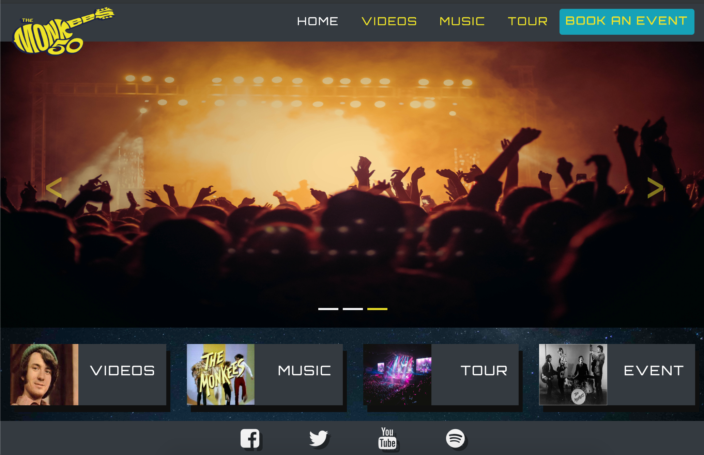

# The Monkees

Milestone Project 1: User-Centric Frontend Development - Code Institute

This is a website for the fans of the famous rock band "The Monkees". It allows them to watch their videos, listen to their musics, check out their tour dates and give the possibility to book the band for a perfomance at their private party (chrismas party, birthday or Wedding).

This website allows the Monkees's fans to get information from any device.

## **Demo**

A live demo can be found [here](https://comanezz.github.io/the_monkees/index.html).
<br>
<br>
<a href="https://comanezz.github.io/the_monkees/index.html" target="_blank"></a>

## UX

**The primary target audiences are their fans or people who already know the rock band.** 

#### User Stories:

- As a new visitor, I want to discover the Monkees's music because I love music and discovering.
- As a fan, I want to get informations about my favorite band (Date tour, New music, Videos) because I want to stay updated with the latest news and I would love to meet them.
- As a music lover, I want to buy a tour ticket because I love going to music shows.
- As a fan or corporate event planner, I want to book the band for a private event (party, weddings, christmas) because I want to make that day special.

#### This project is the best way to achieve these things because:

- This website is easy to navigate.
- There is no overloading information.
- All different information can be found easily.
- It works well on every device.
- All the links redirect the user to the correct page.

##### Wireframes

- [Mobile view](https://github.com/comanezz/the_monkees/blob/master/assets/wireframe/balsamic-mobile-monkees.pdf)
- [Desktop view](https://github.com/comanezz/the_monkees/blob/master/assets/wireframe/balsamic-desktop-monkees.pdf)
  - **Notice:** I changed my mind, I didn't include the market place page and the full background video (Home page) as I found that it was not relevant.

## Features

Each page has a responsive **navbar** with a highlighted button **"Book an event"**  (right side) to catch the eye of the user. 
The **logo** (top left) is bigger than the navbar.
Each page has a footer with **Social Media Icons** linking to the social media pages of the Rock Band.

**Home**

The "Home" page uses a carousel with 3 pictures switching automatically or can be switch manually. 
I decided not to put a title with the band's name on this page because we can clearly see written "The Monkees" on the logo and in the main pictures. 

Each rectangle includes an image and a title which redirect the user to another page of the website.

**Videos**

The "Videos" page features 3 embedded Youtube videos from the Monkees's live shows or video clip.

**Music**

The "Music" page features:
 - 4 images cover
 - 3 Audio players
 - 3 lyrics buttons
 - 1 Spotify player. 

 Each image is used above the audio player and the lyrics button. Each audio player has a different song which is related to the image and the lyrics. 


**Tour**

The "Tour" page features an image (representing the person who will perform in the next events) and the location and dates of the incoming events or previous events. 

**Book an Event**

The "Book an Event" page features a contact form to enable client to make a request. The form require to fill informations such as email, type of event, date, location and additional information. 
At the bottom of the form there is a "send" button to enable the client to confirm the request. 

### Features Left to Implement
- "Book an Event" contact form: This feature already exist but I would like to be able to receive the information sent by the customer - I haven't learn how to do that yet. 
- "Book an Event" contact form: I would like to disable the possibility of sending a booking request when the dates are not available (date from the past or already booked).

## Technologies Used

- **HTML5**
- **CSS3**
- [Bootstrap Framework](https://getbootstrap.com/)
  - The project uses **Bootstrap4** to build a responsive website.
- [Font Awesome 4.7](https://fontawesome.com/v4.7.0/)
    - The project uses **Font Awesome** to provide icons.
- [Google Fonts](https://fonts.google.com/)
  - The project uses **Google Fonts** to style the website fonts.
- **Javascript libraries** used for the responsive navbar, carousel and modal.
    - [Popper.js](https://popper.js.org/)
    - [JQuery](https://jquery.com)
- **IDE** used to develop the website: writting, debugging and running the code.
  - [Cloud9 IDE](https://aws.amazon.com/cloud9/?origin=c9io)
  - [Visual Studio Code](https://code.visualstudio.com/)


## Testing

- [W3C CSS Validation Service](https://jigsaw.w3.org/css-validator/) and [W3C Markup Validation Service](https://validator.w3.org/) has been used to check the validity of the website code.

- The website has been tested on several browsers (**Chrome, Safari, Firefox and Internet Explorer**). It has been tested by using [Chrome DevTools](https://developers.google.com/web/tools/chrome-devtools/) to check the mobile view but also tested on a OnePlus 5 mobile and an Ipad.

### All pages (Home, Videos, Music, Tour, Book an Event)
- The website is fully responsive and behave as expected.

- The logo (in the navbar) always leads back the user to the Home page.

- Every link in the navbar redirect the user to the appropriate page.

- When we are on a page, related clickable link (menu) stays highlighted. This allows the user to know on which page he is.

- All the links in the navbar behave correctly when hovering (change color and underline appears, except for the event button). 

- All the social icons in the footer behave correctly when hovering (change color and scale).

- All social media links in the footer will open a new tab using target="_blank" and redirect user to the correct page.  

### Home page
- The carousel image (Home page) switch images automatically or manually.

- The columns behave correctly.

- The 4 links in the section part redirect the user to the appropriate page.

- Hovering all the links behave correctly.

### Videos page

- All embedded youtube videos work correctly.

- All embedded youtube videos are responsive. Height and width increase or decrease correctly.

### Music page

- The columns behave correctly.

- The audio players work correctly, each audio player plays their appropriate songs.

- All lyrics pop up on the screen correctly when clicking on the lyrics button. 

- All lyrics pop up show the appropriate lyrics related to the song.

- Spotify playlist works correctly. If the user is located in India, the spotify playlist is not working  due to their user policy.

- Hovering all the lyrics buttons behave correctly.

### Tour page

- The image is responsive. Height and width increase or decrease correctly.

- The columns behave correctly. 

- Every location links redirect the user to the correct page by opening a new tab using target="_blank".

- Every ticket button redirect the user to the correct page by opening a new tab using target="_blank".

- Hovering all the links and tickets buttons behave correctly.

### Book an Event page

1. Contact form:
    1. Go to the **Book an Event** page.
    2. Try to submit the empty form and verify that an error message about the required fields appears.
    3. Try to submit the form with all valid input except **email address** (left blank or invalid email address) and verify that a relevant error message appears.
    4. Try to submit the form with all valid input except **type of event**  and verify that a relevant error message appears.
    5. Try to submit the form with all valid input except **day** and verify that a relevant error message appears.
    6. Try to submit the form with all valid input except **month** and verify that a relevant error message appears.
    7. Try to submit the form with all valid input except **year** and verify that a relevant error message appears.
    8. Try to submit the form with all valid input except **city** and verify that a relevant error message appears.
    9. Try to submit the form with all valid input except **state** and verify that a relevant error message appears.
    10. Try to submit the form with all valid input except **additional information** and verify that no error message appears because this input is not required.
    11. Try to submit the form with all valid inputs and verify that no error message appears.

### Problems

- The background image on all pages was taking too much time to load (more than 1.2 s) because the file size was too big (5 mb). 
  <br> Solution: I compressed the image to 270 ko by using [Compress JPEG](https://compressjpeg.com/). Now it loads faster (less than 200 ms).

- Error message from validator.w3.org "The frameborder attribute is not supported in HTML5. Use CSS instead." 
<br> Solution found on [Stack overflow](https://stackoverflow.com/questions/26274082/the-frameborder-attribute-on-the-iframe-element-is-obsolete-use-css-instead). `border: none;` has been added to my iframe in CSS. 

- Error message from validator.w3.org "The allowtransparency attribute on the iframe element is obsolete. Use CSS instead."
  <br> Solution found on [Stack overflow](https://stackoverflow.com/questions/3740700/there-is-no-attribute-allowtransparency). `background-color: transparent;` has been added to my iframe in CSS.

## Deployment

**This website is hosted using GitHub pages, the deployment steps were:**

This site is hosted using GitHub pages, deployed directly from the master branch. The deployed site will update automatically upon new commits to the master branch. In order for the site to deploy correctly on GitHub pages, the landing page must be named index.html.

**To run locally, you can clone this repository directly into the editor of your choice by following these steps:**

1. On GitHub, navigate to the main page of the repository.
2. Under the repository name, click **Clone or download**.
3. In the Clone with HTTPs section, copy the clone URL for the repository.
4. Open the terminal.
5. Type `git clone`, and then paste the URL you copied in Step 3.
``` console
$ git clone https://github.com/USERNAME/REPOSITORY
```
6.Press **Enter**. Your local clone will be created.

To cut ties with this GitHub repository, type `git remote rm origin` into the terminal.

## Credits

### Content

- All the lyrics for the Music page were taken from [Genius.com](https://genius.com/) and [Azlyrics.com](https://search.azlyrics.com/)
- The dates and locations for the Tour page were taken from [Songkick.com](https://www.songkick.com/artists/485568-monkees/gigography) and [viagogo.ie](https://www.viagogo.ie/Concert-Tickets/Rock-and-Pop/The-Monkees-Tickets)
- The text for the Book Event page was written by me.

### Media

- The logo was taken from Google Images.
- Some photos were taken from [Pexels](https://www.pexels.com/), and some were taken from Google Images.
- All videos were taken from [Youtube](https://www.youtube.com/results?search_query=themonkees).
- All musics were taken from [Code Institute Org](https://github.com/Code-Institute-Org/project-assets/tree/master/stream-1/band-assets/audio).
- The spotify album playlist was taken from [Spotify](https://open.spotify.com/album/3WzJHiv489Wb9So4K7csLy).

### Acknowledgements

- I received inspiration for this project from:
  - [ACDC](https://www.acdc.com/) for the Home page layout and [Rolling Stones](https://www.rollingstones.com/live/) for the underline hover in the Navbar. 
- For the "README" section, I followed the example of some of the [sample project](https://github.com/Code-Institute-Solutions/StudentExampleProjectGradeFive) and tips given from **AJGreaves** (Code Institute Student). 

**This is for educational use.**